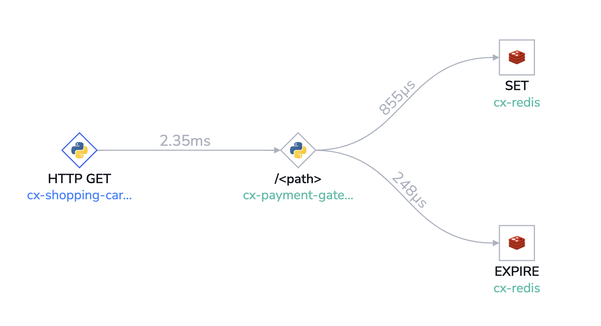

# Microservices Observability Demo V1

## Instructions

This example is for basic study only and is not documentation.    
Full documentation: [https://k3s.io/](https://k3s.io/)  
See Appendix below for a suggested Kubernetes sandbox environment with a quick and easy setup  

### Step 1 - Install the OpenTelemetry Collector on your k8s cluster

This workshop requires OpenTelemetry collector configured for Coralogix: [https://k3s.io/opentelemetry-using-kubernetes/](https://k3s.io/opentelemetry-using-kubernetes/)    

### Step 2 - Setup
Clone repo:
```
git clone https://github.com/coralogix/workshops
```

### Step 3 - Change to workshop dir
Change to the proper directory for workshop example:  

```
cd workshops/otel/microservices-demo
```

### Step 4 - Deploy example
Deploy example to your k8s cluster- this will deploy to the default k8s namespace.  
If you want to change the namespace, edit `yaml/deploy-good.yaml`  
There will be three services spun up:  

- `cx-shopping-cart-reqs` - a requesting service initiating a transaction  
- `cx-payment-gateway-flask` - a server that is a bridge for a transaction to a database- returns a transaction ID to the `shopping-cart`  
- `cx-redis` - an instance of a redis database used for a transaction

```
source deploy-all.sh
```

Deploys the following as seen from the `http://cx-payment-gateway-flask:5000/` root span:  

     
<!--  -->
With healthy low latency spans for all services:  
  
  

### Step 5 - Study results and simulate CI/CD scenarios
Study results in Coralogix portal

Simulate a "bad" deployment:  
```
source deploy-bad.sh
```

This deployment will cause severe sporadic problems in `payment-gateway` such as 404s, a log key:value ` 'transaction': 'failed',` and latency in the service response along with a drop in transaction volume. You can see the latency spikes here:    

   

Alerts and automation can be built around span latency or Payment Gateway 404 responses.  

Roll back the bad deployment for the services to return to normal:  
```
source deploy-good.sh
```  

Span latency will return to normal and Payment Gateway 404 responses will cease.  
  
Study how the example is built:  
- The Python apps that drive this example are in the `python/apps` dir  
- `.yaml` deployment files are in `python/yaml`  
- Dockerfiles for the containers show how the OpenTelemetry instrumentation works and are in the `/python` root level  

#### Bonus Example

Deploy Java based Inventory service:  
```
source deploy-java.sh
```  

### Step 6 - Cleanup
To remove all the deployments/services/pods from the example from your k8s cluster:  
```
source delete-all.sh
```

### Appendix - Quick Kubernetes Sandbox Setup  
- AWS EC2 t2.xl VM with 22GB of storage w/ Ubuntu Linux or equivalent other cloud provider  
- Install k3s minimal Dockerless Kubernetes- use script top right of homepage: [https://k3s.io/](https://k3s.io/) 
- Every time you open a new shell, to use k3s for helm, kubectl, etc you must set the appropriate env variable:
    ```
    sudo chmod 644 /etc/rancher/k3s/k3s.yaml  
    export KUBECONFIG=/etc/rancher/k3s/k3s.yaml
    ```  
    This script is included in the workshop in the k3s folder: `source ./k3s/k3s.sh`  
- Install helm- use bash script: [https://helm.sh/docs/intro/install/](https://helm.sh/docs/intro/install/])  
- Install k9s kubernetes monitor: [https://k9scli.io/](https://k9scli.io/) 
    - Recommend to download appropriate release and gunzip / tar -xf the release [https://github.com/derailed/k9s/releases](https://github.com/derailed/k9s/releases)