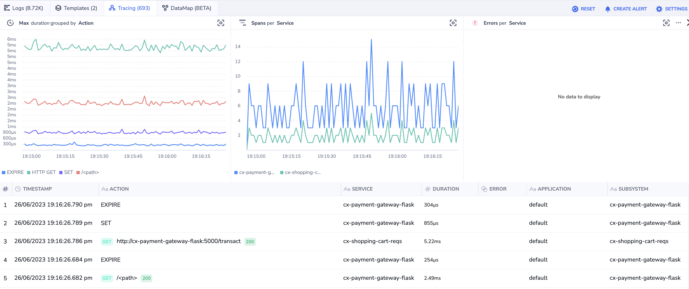
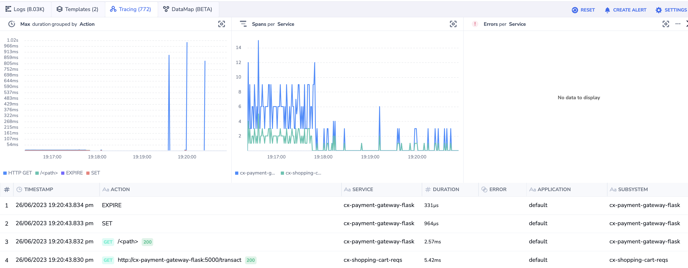

# Microservices Observability Demo V1

## Instructions

Requires a completely operational OpenTelemetry collector configured for Coralogix: [https://coralogix.com/docs/opentelemetry-using-kubernetes/](https://coralogix.com/docs/opentelemetry-using-kubernetes/)    
This example is for basic study only and is not documentation.    
Full documentation: [https://coralogix.com/docs/](https://coralogix.com/docs/)

### Step 1 - Setup
Clone repo:
```
git clone https://github.com/coralogix/workshops
```

### Step 2 - Change to workshop dir
Change to the proper directory for workshop example:  

```
cd workshops/otel/microservices-demo
```

### Step 3 - Deploy example
Deploy example to your k8s cluster- this will deploy to the default k8s namespace.  
If you want to change the namespace, edit `yaml/deploy-good.yaml`  
There will be three services spun up:  

- `cx-shopping-cart-reqs` - a requesting service initiating a transaction  
- `cx-payment-gateway-flask` - a server that is a bridge for a transaction to a database- returns a transaction ID to the `shopping-cart`  
- `cx-redis` - an instance of a redis database used for a transaction

```
source deploy-all.sh
```

Deploys the following as seen from the `http://cx-payment-gateway-flask:5000/` root span:  


With healthy low latency spans for all services:  
  
{width=340} git  

### Step 4 - Study results and simulate CI/CD scenarios
Study results in Coralogix portal

Simulate a "bad" deployment:  
```
source deploy-bad.sh
```

This deployment will cause severe sporadic problems in `payment-gateway` such as 404s, a log key:value ` 'transaction': 'failed',` and latency in the service response along with a drop in transaction volume. You can see the latency spikes here:    

{width=340}  
  
Roll back the bad deployment for the services to return to normal:  
```
source deploy-good.sh
```

Study how the example is built:  
- The Python apps that drive this example are in the `python/apps` dir  
- `.yaml` deployment files are in `python/yaml`  
- Dockerfiles for the containers show how the OpenTelemetry instrumentation works and are in the `/python` root level  

Build alerts and dashboards (examples TBD)  

### Step 5 - Cleanup
To remove all the deployments/services/pods from the example from your k8s cluster:  
```
source delete-all.sh
```