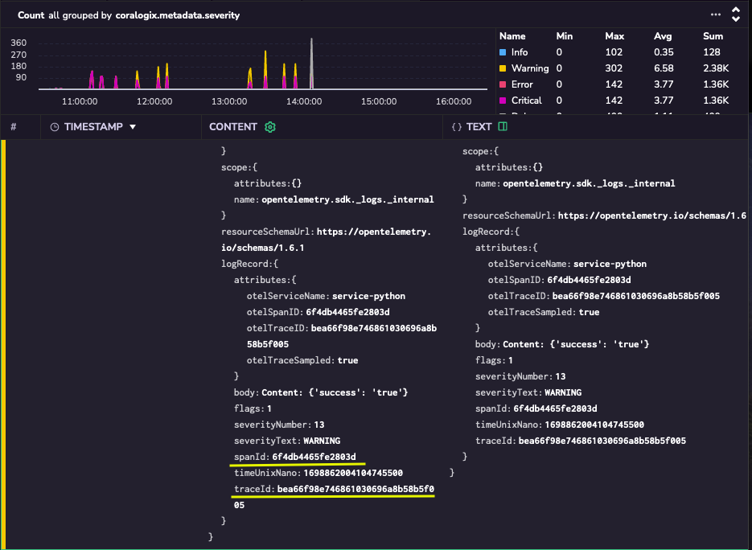
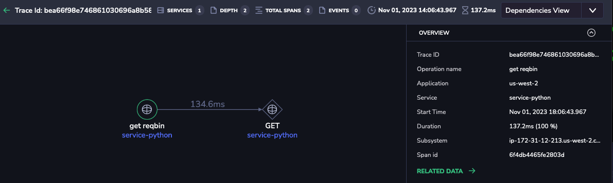
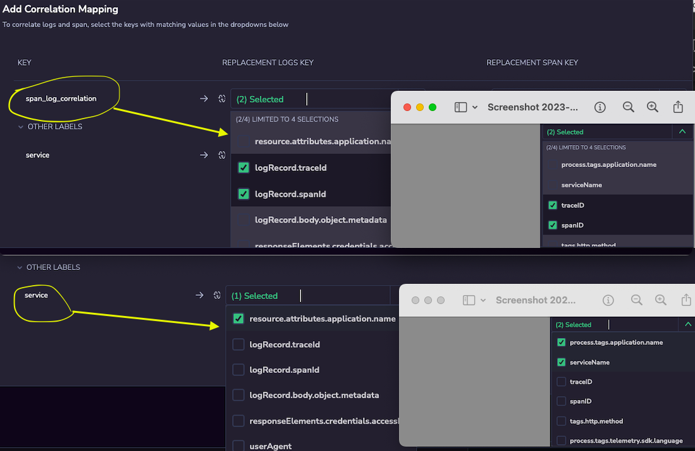
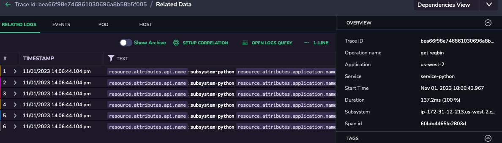

# OpenTelemetry for Python / Monolith

## Instructions

This example is for basic study only and is not documentation.    
Full documentation: [https://coralogix.com/docs/](https://coralogix.com/docs/)  
Requirements:  
- Cloud Linux host (Debian preferred but RPM flavors will work)  
- Updated versions and sufficient permissions for installing software  
- Updated verson of `python` and `pip` installed 
- Proper IDE i.e. Visual Studio Code 
- Python Version 3.10 or higher  

### Step 1 - Setup
Clone repo:
```
git clone https://github.com/coralogix/workshops
```  

### Step 2 - Change to workshop dir
Change to the proper directory for workshop example:  

```
cd ./workshops/workshops/otel/monolith-workshop/python/
```  

### Step 3 - Set up Otel Collector on a Linux host     
Download and install latest CONTRIB release version from here:  
[https://github.com/open-telemetry/opentelemetry-collector-releases/releases](https://github.com/open-telemetry/opentelemetry-collector-releases/releases)  

Collector `config.yaml` must be configured with Coralogix Exporter. See the "Send Data to Coralogix" section for determining telemetry endpoint and and API key: [https://coralogix.com/docs/guide-first-steps-coralogix/](https://coralogix.com/docs/guide-first-steps-coralogix/)    

See the `config.yaml` example in `./workshops/workshops/otel/monolith-workshop/python/otelcol`  
This file can be updated in `/etc/otelcol/contrib/config.yaml` - make a backup of the default version first.    
  
Manage the collector using `systemctl` i.e. `sudo systemctl restart otelcol`  
More info is here: [https://coralogix.com/docs/guide-first-steps-coralogix/](https://coralogix.com/docs/guide-first-steps-coralogix/)  
  
You can check Collector status with these status URLS:  
`http://localhost:55679/debug/tracez`  
`http://localhost:55679/debug/pipelinez`    
For more info: [zpages docs](https://github.com/open-telemetry/opentelemetry-collector/blob/main/extension/zpagesextension/README.md)  


### Step 4 - Run Python client in new terminal  

#### Pre-requisite to Run a Python App
- Run ```python3 --version``` to check you have python3 installed. If not follow the python3 installation document for your linux distribution. For ubuntu follow
- Run ```pip3 --version``` to check pip3 is installed. If not follow the pip3 installation documentation for your linux distribution. For ubuntu use command ```sudo apt-get install python3-pip```
- For ubuntu Run ```sudo apt upgrade``` to upgrde already installed packages. If you receive a message to reboot your server do so before moving on to the next steps.

#### Run Python App
This application make 100 requests to `https://reqbin.com/echo/get/json` and then exit.

Run following scripts found under [./python](.):
```
source setup-python.sh
source setup-python-env.sh
source start-python.sh
```
**Note**: Running ```source setup-python.sh``` would output long list of packages and with messages like Successfully installed *opentelemetry-instrumentation-some-package*.  

### Step 5 - Study results in Coralogix portal  
  
**Explore >> Logs UI**  

**Explore >> Tracing UI**  

**Individual Trace**  

**Setup Correlation (logs in-context)**  

**Logs In-context**  

```