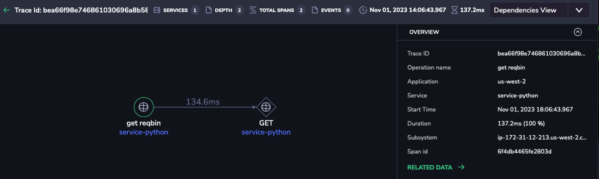

## Python Application Instrumentation
- This setup is tested in debian based (ubuntu) distribution.
- Enusure that you have python 3 running.
- Python app used in this example is emitting application logs to console.

### Set up Otel Contrib Collector on a Linux host.
- Download and install **OpenTelemetry Contrib** package for a linux distribution from [here](https://github.com/open-telemetry/opentelemetry-collector-releases/releases/)
- Extract a package that you downloaded using the correct package manager module, this will create and start **otelcol-contrib** service.
- otelcol-contrib uses a **config.yaml** file in the directory **/etc/otelcol-contrib/**
- Replace the **config.yaml** file with the example file in the [./otelcol](./otelcol) folder and update coralogix exporter section with your [api key](https://coralogix.com/docs/send-your-data-api-key/), [Coralogix domain](https://coralogix.com/docs/coralogix-domain/), and [application/subsystem names](https://coralogix.com/docs/application-and-subsystem-names/).
- If your application is writing logs to a file system, use [filelog receiver](https://github.com/open-telemetry/opentelemetry-collector-contrib/tree/main/receiver/filelogreceiver) in the **config.yaml**.
- Restart the **otelcol-contrib** service.

### Pre-requisite to Run a Python App
- Run ```python3 --version``` to check you have python3 installed. If not follow the python3 installation document for your linux distribution. For ubuntu follow
- Run ```pip3 --version``` to check pip3 is installed. If not follow the pip3 installation documentation for your linux distribution. For ubuntu use command ```sudo apt-get install python3-pip```
- For ubuntu Run ```sudo apt upgrade``` to upgrde already installed packages. If you receive a message to reboot your server do so before moving on to the next steps.

### Run Python App
This application make 100 requests to `https://reqbin.com/echo/get/json` and then exit.

Run following scripts found under [./python](.):
```
source setup-python.sh
source setup-python-env.sh
source start-python.sh
```
**Note**: Running ```source setup-python.sh``` would output long list of packages and with messages like Successfully installed *opentelemetry-instrumentation-some-package*.

### Validate in Coralogix
#### Explore >> Logs UI

#### Explore >> Tracing UI

#### Individual Trace

#### Setup Correlation (logs in-context)

#### Logs In-context
